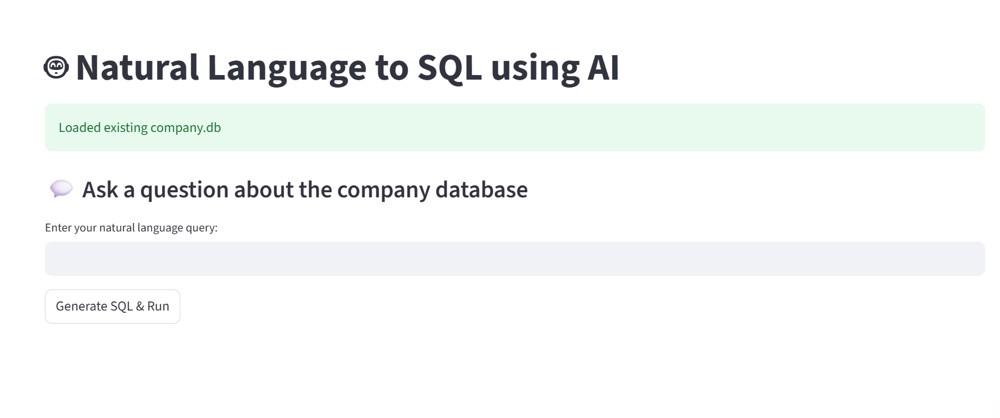

# NLP to SQL Query Generator

## Project Overview
This project is an AI-powered tool that converts plain English questions into SQL queries using LLMs (Large Language Models). It supports both:
## User Interface


## Features

- Upload your `.db or sql` file 📂
- Ask a question in natural language 💬
- See the generated SQL query 💾
- Execute it instantly on your dataset ⚡
- Use either **OpenAI's API** 

##  Installation & Setup
### 1️. Clone the Repository
```bash
git clone https://github.com/ishitapatil08/NLP-to-SQL-Query-Generator.git
```
### 2. Create an Enviornment
```bash
python -m venv .venv 
```
### 3. Install Dependencies
```bash
pip install -r requirements.txt
```
### 3. Run the Streamlit App
```bash
streamlit run streamlit_app.py
```
## Usage
1. Enter your **OpenAI API Key** in the **Project Settings** section or let it load from `.env`.
2. Provide the **Data File** to your SQLite file.
3. Enter a natural language query (e.g., "Show me all orders placed in June").
4. Click **Generate SQL** to get the SQL query.
5. Validate & Execute the query to see the results.

## Contributing
Pull requests are welcome! If you’d like to contribute, please open an issue first to discuss your changes.
